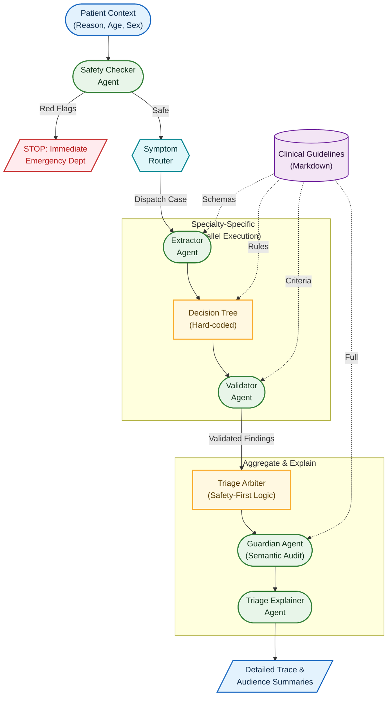

# TriAgent Pediatrics

TriAgent Pediatrics is a sophisticated multi-agent system designed for automated pediatric medical triage. It processes patient consultation reports in natural language to determine the appropriate level of care, leveraging a hybrid approach that combines Large Language Models (LLMs) with deterministic, guideline-based rules. The system is built for reliability, explainability, and adherence to clinical safety protocols.

## Overview

The system ingests a patient's reason for consultation, age, and sex, and outputs a final triage decision (e.g., Emergency Department, Primary Care Today, Primary Care Appointment). This is achieved through a pipeline of specialized agents, each with a distinct role in the triage process.

The core design philosophy is to use LLMs for tasks requiring nuanced understanding and flexibility (like data extraction and validation) while enforcing critical safety and business logic through deterministic code. This ensures that the system is both intelligent and predictable.

## Key Features

*   **Multi-Agent Architecture**: The triage process is decomposed into a series of collaborating agents:
    *   **Safety Checker**: Immediately scans for life-threatening red flags.
    *   **Triage Router**: Directs the case to relevant medical specialties.
    *   **Specialty Orchestrator**: Manages parallel evaluation by different specialty experts.
    *   **Triage Aggregator/Arbiter**: Synthesizes specialty findings into a single, coherent decision.
    *   **Triage Explainer**: Generates tailored explanations for different audiences (e.g., medical staff, patient families) and provides a rich visual trace for debugging.
*   **Hybrid AI & Rule-Based System**: Combines the power of LLMs (using `pydantic-ai` and `outlines`) for structured data extraction and semantic validation with hard-coded `SpecialtyRuler` classes that implement deterministic triage logic based on clinical guidelines.
*   **Guideline-Grounded Decisions**: All triage logic is derived from the pediatric guidelines stored in the `/guidelines` directory. These documents are also used as context for the LLMs to ensure their reasoning aligns with established protocols.
*   **Structured & Reliable Outputs**: By leveraging Pydantic models and the `outlines` library, the system ensures that all LLM outputs are in a valid, predictable JSON format, eliminating runtime parsing errors.
*   **Advanced Explainability**: The `TriageExplainer` not only generates natural language summaries but also uses the `rich` library to render a detailed, color-coded visual trace of the entire decision-making process in the terminal.

## Architecture

A patient case flows through the system in a series of well-defined steps:

1.  **Patient Context Creation**: The initial input (reason for consultation, age, sex) is encapsulated in a `PatientContext` object.

2.  **Safety Check**: The `SafetyChecker` agent performs an initial assessment. If it detects immediate, life-threatening red flags (e.g., respiratory distress, signs of shock), the process is halted, and the case is escalated directly to the Emergency Department.

3.  **Specialty Routing**: If the case passes the safety check, the `TriageRouter` agent analyzes the complaint and selects all relevant medical specialties for further evaluation (e.g., a case with fever and cough would be routed to `FEVER` and `RESPIRATORY`).

4.  **Parallel Specialty Evaluation**: The `SpecialtyOrchestrator` dispatches the case to be evaluated concurrently by the selected specialty modules. Each specialty evaluation consists of:
    *   **Data Extraction**: An LLM-based agent extracts structured clinical information from the patient complaint into a specialty-specific Pydantic model (e.g., `FeverModel`).
    *   **Rule-Based Triage**: A deterministic `SpecialtyRuler` (e.g., `FeverRuler`) applies guideline-based logic to the extracted data to produce an initial triage level.
    *   **AI Validation**: A separate LLM-based agent validates the extraction and reasoning of the rule-based step, acting as a quality assurance layer.

5.  **Aggregation & Final Decision**: The `TriageAggregator` collects the validated results from all specialties.
    *   The deterministic `TriageArbiter` first applies a "Safety-First" protocol, prioritizing the highest urgency level proposed by any specialty.
    *   The `Guardian` agent then performs a final semantic audit, checking for clinical coherence, resolving conflicts, and flagging cases that require human review.

6.  **Explanation**: The `TriageExplainer` receives the final decision and all intermediate results. It generates summaries tailored to the requested audience and renders a comprehensive visual trace of the agent interactions.

## Mermaid Diagram


## Directory Structure

```
.
├── agents/             # Core agents: Router, Orchestrator, Aggregator, etc.
├── core/               # Central Pydantic data models (PatientContext, FinalTriageDecision).
├── guidelines/         # Medical triage guidelines for each specialty in Markdown.
├── symptoms/           # Implementations for specific medical specialties.
│   ├── base.py         # Abstract base classes for specialty models and rulers.
│   └── fever/          # Example implementation for the 'Fever' specialty.
│       ├── model.py    # Pydantic model for fever-related data extraction.
│       └── ruler.py    # Deterministic triage rules for fever cases.
├── utils/              # Utility functions for parsing and data conversion.
└── test.py             # Main script to run a single triage case from the CLI.
```

## How to Run

The system can be tested using the `test.py` script, which processes a single patient case provided via command-line arguments.

**Prerequisites:**
You need a local or remote Hugging Face model environment and the required Python dependencies installed. Key dependencies include: `torch`, `transformers`, `pydantic-ai`, `outlines`, `pandas`, and `rich`.

**Execution:**

Run the script from your terminal. You can customize the patient case and other parameters.

```bash
python test.py \
  --model "path/to/your/hf_model" \
  --reason "Lleva dos días con fiebre y tiene una tos tan fuerte que acaba vomitando; apenas quiere comer." \
  --age "11 years" \
  --sex "female" \
  --audience MEDICAL_STAFF PATIENT_FAMILY
```

### Arguments

*   `--model`: Path or Hugging Face repository name of the causal language model to use.
*   `--dtype`: The torch data type for the model (e.g., `bf16`, `fp16`, `fp32`). Default is `bf16`.
*   `--reason`: The patient's reason for consultation (free text).
*   `--age`: The patient's age (e.g., "3 months", "5 years").
*   `--sex`: The patient's sex (`male` or `female`).
*   `--audience`: The target audience(s) for the explanation. Choose from `MEDICAL_STAFF`, `PATIENT_FAMILY`, `ADMINISTRATIVE`. You can specify multiple audiences.

The script will output a detailed visual trace of the agent pipeline followed by the generated explanations for the specified audiences.
